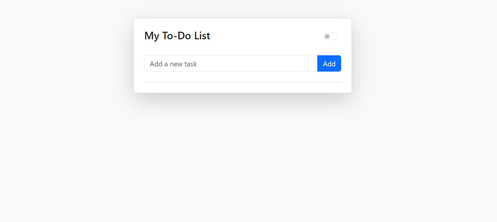
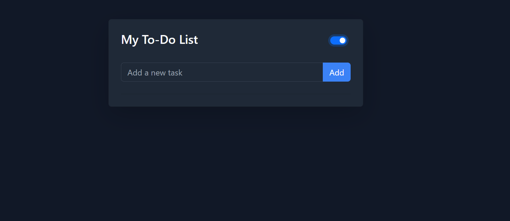
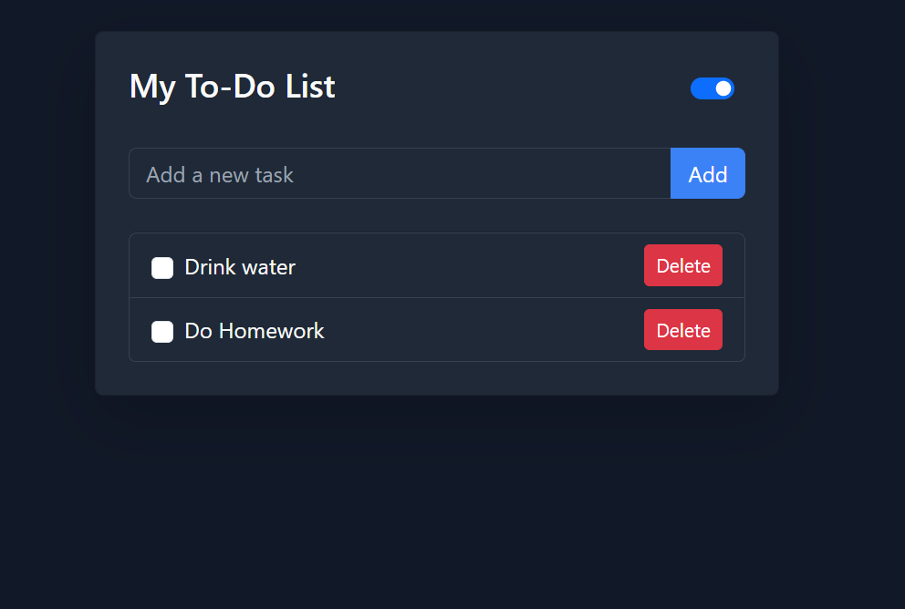
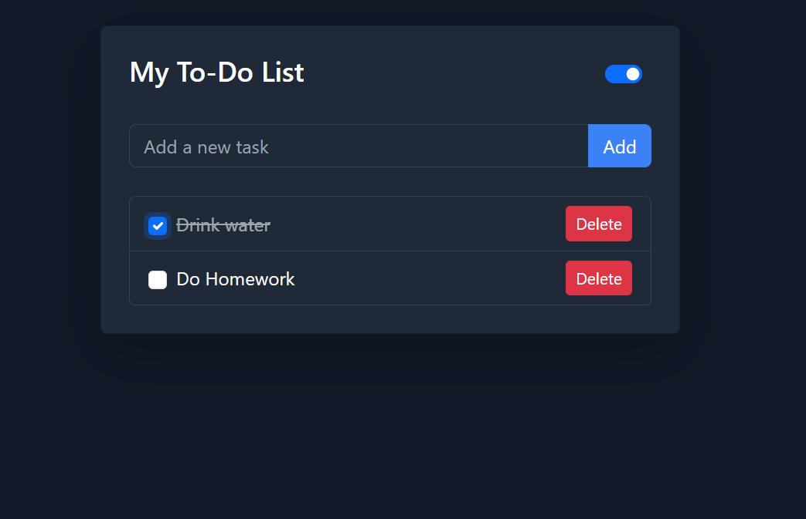
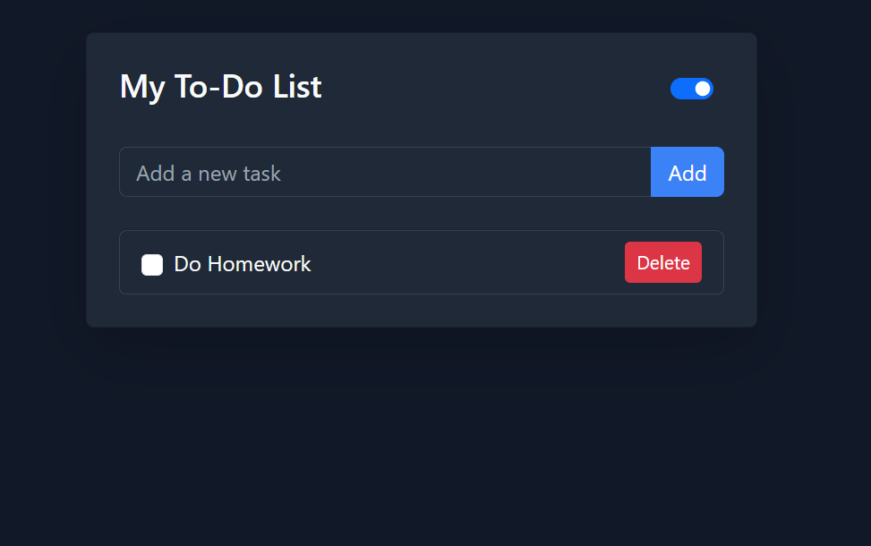

# To-Do-List📝


A responsive and interactive **To-Do List** application that helps users manage daily tasks efficiently with theme support.

---

## 🌟 Features

- **Add Tasks:** Add tasks using the add button or by pressing the Enter key.  
- **Task Management:** Each task has a checkbox to mark it as completed and a delete button to remove it.  
- **Theme Toggle:** Switch between light and dark modes. Your theme preference is saved even after page refresh.  
- **Validation:** Displays an error message if the input field is empty.  
- **Responsive Design:** Works seamlessly on all devices and screen sizes.  

## Screenshots

### Light Theme


### Dark Theme


### Task Actions
- Adding a task:


- Completed task (checkbox checked):


- Deleting a task (after deletion):



## 🛠 Technologies Used

- **HTML5**  
- **CSS3**  
- **JavaScript (ES6+)**  
- **Bootstrap 5**  


## 💻 How to Run Locally

1. Clone the repository:
   ```bash
   git clone https://github.com/Laiba-li/To-Do-List.git
   ```
2. Open the `index.html` file in your web browser.
3. Start adding tasks, toggle theme, and manage your tasks.

